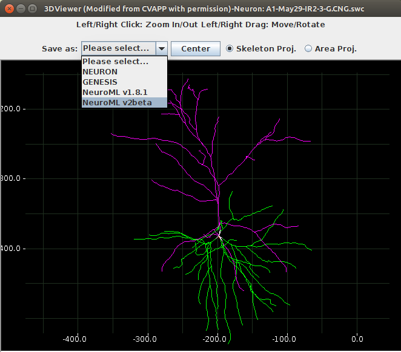

## Cell morphology from NeuroMorpho.Org visualised on Open Source Brain

### Local software requirements

None, apart from an up to date web browser.

### Instructions

#### 1. Download morphology from NeuroMorpho.Org in NeuroML 2 format
 
Pick a cell, e.g. [this one](http://neuromorpho.org/neuron_info.jsp?neuron_name=A1-May29-IR2-3-G)

Select **3D Neuron Viewer**. This will show a 3D view of the cell in an external 
window (Java Applet, see below if you have issues). Select in **Save as** the option
to download in NeuroML2 format.

If the 3D Neuron Viewer does not open you may have to change your setting to allow 
Java Applets to run. See: *"The 3D Neuron Viewer does not launch. What can I do?"* [here](http://neuromorpho.org/myfaq.jsp).

For Mac you may need to specify where the Java Web Start is located (to run the jnlp file). 
When it asks which application to open with, navigate to the root directory (not 
Applications), go to "System" -> "Library" -> "CoreServices" and pick "Java Web Start".

If there is still an issue, just download the SWC version of the morphology (via **Morphology File (Standardized)**)
or get a copy of the NeuroML 2 file [here](files/A1-May29-IR2-3-G.cell.nml).

#### 2. Set up user account on GitHub
 
 ... 

- Add NML file to new repository

... 

- Sign up to Open Source Brain

... 

- Create new project on OSB

...

- Visualise cell in 3D

... 
